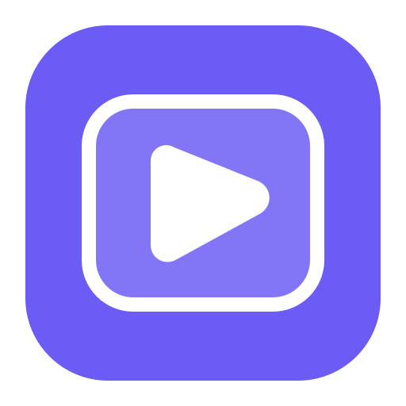

<p align="center">
  
</p>

# Видео — Video Android

Android-приложение для автомобильных магнитол и планшетов: локальное видео и музыка, работа с внутренней памятью и внешними накопителями, крупный интерфейс для использования в автомобиле и дополнительные онлайн-источники.

## Текущая версия

`0.9.3` (`versionCode 13`)

Основная рабочая ветка: `audit-full-app-fix-ui-polish`.

## Основные возможности

- локальное видео и музыка из внутренней памяти, USB-флешек и съёмных дисков;
- Storage Access Framework / DocumentFile для выбора накопителей и папок;
- сохранение найденной медиатеки и быстрый повторный запуск;
- вложенная навигация по папкам;
- история и продолжение просмотра;
- избранное и аудиоплейлисты;
- крупный landscape-интерфейс для автомобильной магнитолы;
- AndroidX Media3 для воспроизведения и стриминга;
- LibVLC 3.7.0 как резервный декодер локальных файлов;
- поддержка RUTUBE через AndroidX Browser Custom Tabs;
- IPTV/плейлисты пользователя без встроенных сторонних плейлистов;
- unit-тесты и GitHub Actions для проверки сборки.

## Целевые устройства

- автомобильные Android-магнитолы, основной ориентир — `1920×720`;
- Android-планшеты;
- ABI текущей сборки — `arm64-v8a`;
- `minSdk 23`;
- `targetSdk 36`.

## Технологии

- Kotlin;
- Jetpack Compose;
- AndroidX Lifecycle;
- AndroidX Media3;
- AndroidX Browser;
- Storage Access Framework / DocumentFile;
- LibVLC 3.7.0;
- Kotlin Coroutines.

## Проверка и сборка

```bash
./gradlew clean
./gradlew testDebugUnitTest
./gradlew lintDebug
./gradlew assembleDebug
```

В GitHub Actions также используется:

```bash
gradle :app:assembleDebug --stacktrace
```

Debug APK создаётся по пути:

```text
app/build/outputs/apk/debug/app-debug.apk
```

## Приоритеты проекта

1. Стабильное воспроизведение локального видео.
2. Быстрая работа с большими USB-накопителями и дисками.
3. Крупный и читаемый автомобильный интерфейс.
4. Минимум лишних зависимостей и фоновой активности.
5. Без рекламы, аналитики, трекеров и Google Play Services.

## Что требует проверки на физической магнитоле

- выбор внутренней памяти, USB-флешки и съёмного HDD;
- MP4, MOV, MKV большого размера и AVI;
- аппаратное декодирование и резервный LibVLC;
- полноэкранный режим;
- RUTUBE через системный браузер;
- читаемость интерфейса на экране `1920×720`.
